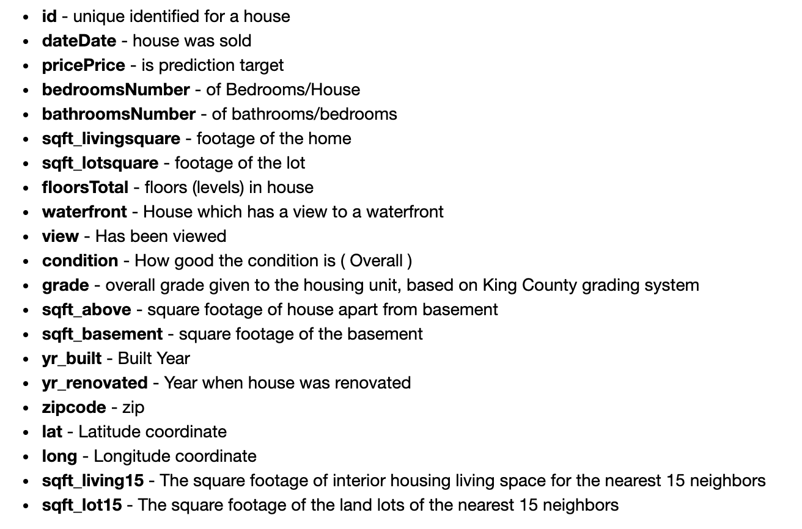
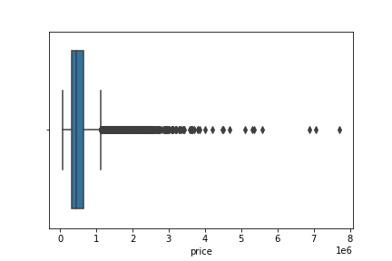
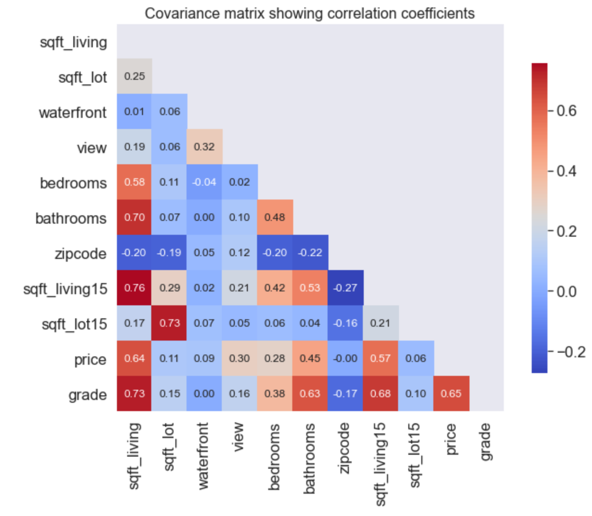

# Overview

The goal of this project is to look into the King County, Washington housing market from the perspective of a home buyer, potentially a first time home buyer.  Through EDA (exploratory data analysis) and linear regression models, I hope to find the features most relevant to the cost of a home in the King County market. 

# Exploration

1. Analyze the housing market in King County, Washington from the data, May 2014-May 2015.  
2. Research the factors and features that are most relevant to the cost of a home in King County and find out what features have the highest correlation to pricing. 
3. Build some linear regression models, feed in the relevant features, and see the results of each.  Then, choose the best model based on the results of the data and the transformations done to it. 

# Data and methods
Based on the sourced data of King County, Washington's housing market, we find these as the variables:

There was a lot of data scrubbing involved due to a multitude of outliers in some key variables:
* Bathrooms
* Bedrooms
* Price
* Sqft_lot

The box plots for each were as follows, pre-scrubbing:
**Bedrooms above 5 were dropped**

**Prices above 1.5 million were dropped**

**Bathrooms above 4 were dropped**

**Sqft_lot above 100,000 were dropped**

After dropping these outliers, the data was much easier to manage.  

I created a heat map to see where there was collinearity:

Then, I made a covariance matrix heat map to find the variables that had the highest correlation to price:

Based on this information, we see that grade, bathrooms, bedrooms, sqft_living and sqft_living15 have the highest correlation to price.  Given that sqft_living and sqft_above have such a collinearity between each other, sqft_above was dropped. 

I decided to create a few different models: the first where I didn't transform the data at all and just did a linear regression based on the cleaned data. The second where I standardized the data.  The third where I log-transformed the data. 

# Results

The first of my results is a map of longitude and latitude against price of the housing market, where the red dots indicate houses above $1 million and the blue dots indicate under.  The dates are varying darkness of blue and red to show a skew towards the lower and higher end, respectively:

Based on the models, I found with the first model that there was an RMSE (root mean squared error) of about $160,000.  I am using this number because with my best and model, the standardized data model, I also standardized the MSE (mean squared error) and RMSE of the price.  I was able to get an R-squared of .597 with this model and a Jarque-Bera of 100.437.  My QQ plot looked as follows:

 

# Conclusions

Based on the data and models, we see that grade and sqft_living have the highest effect on the price of a home.  Whereas, after a house has 3 or 4 bedrooms, the price begins to tail off. 

The issue I ran into is one mentioned before, where my RMSE and MSE prices were transformed and thus, gave a very small number.  So, given that, I went with the RMSE of the first, non-transformed model. 

# Next steps

* Gather more data on housing, especially more data on the expensive houses so as to create a better analysis of the overall market. 
* Develop a new model that standardizes the data, but doesn't perform a transformation on the price that I can't sort out how to reverse without completely re-engineering the model and data.
* Perform more EDA on the features.  See what's affecting the R-squared values the most. 

